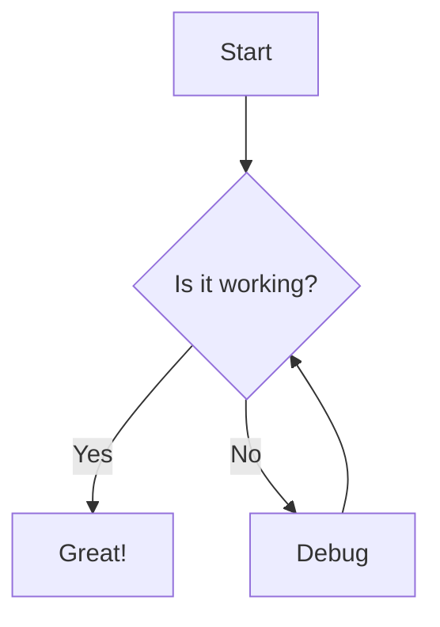

import { Steps } from '@astrojs/starlight/components'
import PackageManagerCommand from '@/components/PackageManagerCommand.astro'

This guide helps you add Mermaid Diagrams to Starlight.

## Steps by steps

<Steps>

1.  Start by installing the [`rehype-mermaid`](https://github.com/remcohaszing/rehype-mermaid):

    <PackageManagerCommand command="add rehype-mermaid" />

2.  Setup Astro config:

    ```js ins={4, 13}
    # astro.config.mjs

    // ...
    import rehypeMermaid from "rehype-mermaid"

    export default defineConfig({
      markdown: {
        syntaxHighlight: {
        type: 'shiki',
        excludeLangs: ['mermaid', 'math'],
        remarkPlugins: [rehypeMermaid],
      },
      integrations: [
        starlight({
          // ...
          customCss: ['./src/styles/mermaid.css',],
        })
      ],
    })
    ```
</Steps>

## Example

````mdx
# src/content/docs/example.mdx


````

The code above generates the following on the page:


## Resources

1. [Mermaid diagrams in markdown](https://astro-digital-garden.stereobooster.com/recipes/mermaid-diagrams-in-markdown)
