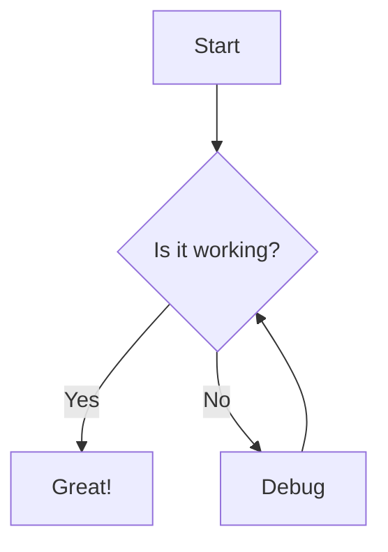
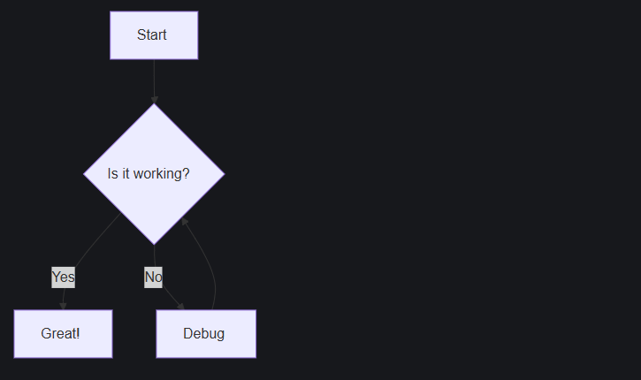

import { Steps } from "@astrojs/starlight/components";
import PackageManagerCommand from "@/components/PackageManagerCommand.astro";

:::note
For the best experience, we recommend using [`astro-mermaid`](https://github.com/joesaby/astro-mermaid) to render Mermaid diagrams in Astro.
:::

This guide helps you add Mermaid diagrams to your Starlight documentation site using `rehype-mermaid`.

## Step-by-step Guide

<Steps>

1. Install dependencies

   First, install [`rehype-mermaid`](https://github.com/remcohaszing/rehype-mermaid) and Playwright (required for rendering):

   <PackageManagerCommand command="add rehype-mermaid playwright playwright-chromium" />

2. Configure Astro

   Update your `astro.config.mjs`:

   ```js ins={5, 8-19}
   // astro.config.mjs

   import { defineConfig } from 'astro/config';
   import starlight from '@astrojs/starlight';
   import rehypeMermaid from 'rehype-mermaid';

   export default defineConfig({
     markdown: {
       syntaxHighlight: {
         type: 'shiki',
         excludeLangs: ['mermaid', 'math'],
       },
       rehypePlugins: [rehypeMermaid],
     },
     integrations: [
       starlight({
         customCss: ['./src/styles/mermaid.css'],
       }),
     ],
   });
   ```

</Steps>

## Example Usage

Create a sample file like `src/content/docs/example.mdx` and include the following:

````mdx

````

The diagram above will render like this:



## Resources

1. [astro-mermaid](https://github.com/joesaby/astro-mermaid)
2. [Mermaid Diagrams in Markdown with Astro | Astro Digital Garden](https://astro-digital-garden.stereobooster.com/recipes/mermaid-diagrams-in-markdown)
