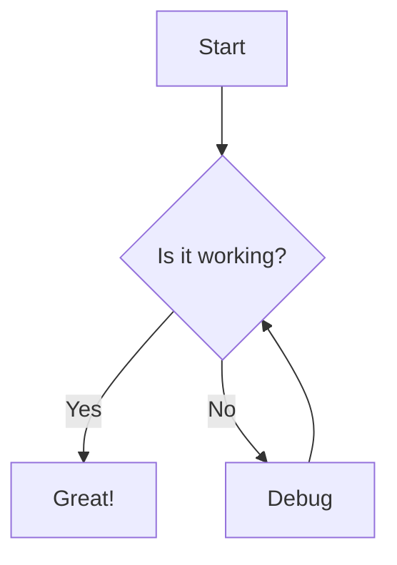
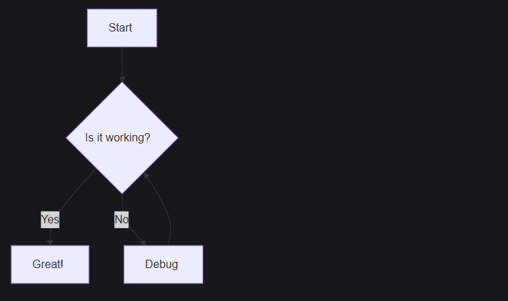

:::caution
This recipe requires **Astro v7** and **Starlight v0.41**.
:::

import { Steps } from "@astrojs/starlight/components";
import PackageManagerCommand from "@/components/PackageManagerCommand.astro";

:::note
For the best experience, we recommend using [`astro-mermaid`](https://github.com/joesaby/astro-mermaid) to render Mermaid diagrams in Astro.
:::

This guide helps you add Mermaid diagrams to your Starlight documentation site using Satteri.

## Step-by-step Guide

<Steps>

1. **Install dependencies**

   First, install `satteri`:

   <PackageManagerCommand command="add satteri" />

2. **Configure Astro**

   Update your `astro.config.mjs` to use the Satteri processor with the `satteriMermaid` plugin:

   ```js ins={3, 5, 13, 17}
   // astro.config.mjs
   import { satteri } from "@astrojs/markdown-satteri";
   import { defineConfig } from "astro/config";
   import starlight from "@astrojs/starlight";
   import { satteriMermaid } from "./src/plugins/satteri-mermaid";

   export default defineConfig({
     markdown: {
       syntaxHighlight: {
         type: "shiki",
         excludeLangs: ["mermaid"],
       },
       processor: satteri({
         hastPlugins: [satteriMermaid],
       }),
     },
     integrations: [
       starlight({
         customCss: ["./src/styles/mermaid.css"],
       }),
     ],
   });
   ```

</Steps>

## Example Usage

Create a sample file like `src/content/docs/example.mdx` and include the following:

````mdx

````

The diagram above will render like this:



## Resources

1. [Satteri documentation](https://satteri.dev)
2. [Mermaid Diagrams in Markdown with Astro - Astro Digital Garden](https://astro-digital-garden.stereobooster.com/recipes/mermaid-diagrams-in-markdown)
