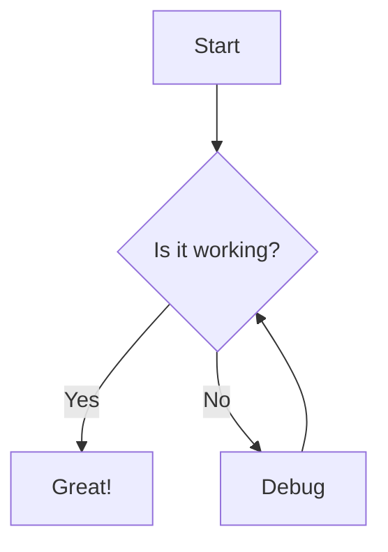

:::caution
This recipe requires **Astro v7**, **Starlight v0.41**, **satteri** and **@astrojs/markdown-satteri**.
:::

import { Steps } from "@astrojs/starlight/components";
import PackageManagerCommand from "@/components/PackageManagerCommand.astro";

:::note
For the best experience, we recommend using [`astro-mermaid`](https://github.com/joesaby/astro-mermaid) to render Mermaid diagrams in Astro.
:::

This guide helps you add Mermaid diagrams to your Starlight documentation site using Sätteri.

## Step-by-step Guide

<Steps>

1. **Install dependencies**

   Install `satteri` and `@astrojs/markdown-satteri`:

   <PackageManagerCommand command="add satteri @astrojs/markdown-satteri" />

2. **Create the Sätteri Mermaid plugin**

   Save the following code as `src/plugins/satteri-mermaid.ts`:

   ```ts
   // src/plugins/satteri-mermaid.ts
   import { defineHastPlugin } from "satteri";

   export const satteriMermaid = defineHastPlugin({
     name: "mermaid",
     element: {
       filter: ["pre"],
       visit(node, ctx) {
         const codeChild = node.children?.find(
           (c) => c.type === "element" && (c as any).tagName === "code",
         );
         if (!codeChild || codeChild.type !== "element") return;

         const lang = (codeChild as any).data?.lang;

         if (lang === "mermaid") {
           const text = ctx.textContent(codeChild);
           ctx.replaceNode(node, {
             type: "element",
             tagName: "div",
             properties: { className: ["mermaid"] },
             children: [{ type: "text", value: text }],
           } as any);
         }
       },
     },
   });
   ```

3. **Configure Astro**

   Update your `astro.config.mjs` to use the Sätteri processor with the `satteriMermaid` plugin:

   ```js ins={3, 5, 13, 16}
   // astro.config.mjs
   import { satteri } from "@astrojs/markdown-satteri";
   import { defineConfig } from "astro/config";
   import starlight from "@astrojs/starlight";
   import { satteriMermaid } from "./src/plugins/satteri-mermaid";

   export default defineConfig({
     markdown: {
       syntaxHighlight: {
         type: "shiki",
         excludeLangs: ["mermaid"],
       },
       processor: satteri({
         hastPlugins: [satteriMermaid],
       }),
     },
     integrations: [
       starlight({
         customCss: ["./src/styles/mermaid.css"],
       }),
     ],
   });
   ```

</Steps>

## Example Usage

Create a sample file like `src/content/docs/example.mdx` and include the following:

````mdx

````

The diagram above will render like this:


## Resources

1. [Sätteri documentation](https://satteri.bruits.org)
2. [Mermaid Diagrams in Markdown with Astro - Astro Digital Garden](https://astro-digital-garden.stereobooster.com/recipes/mermaid-diagrams-in-markdown)
